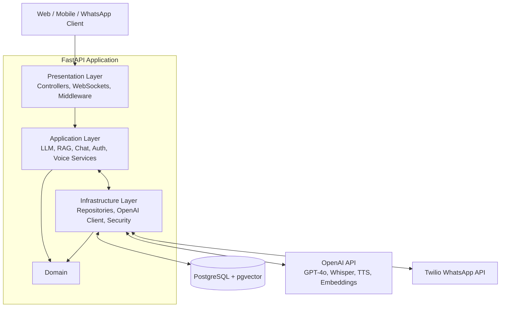
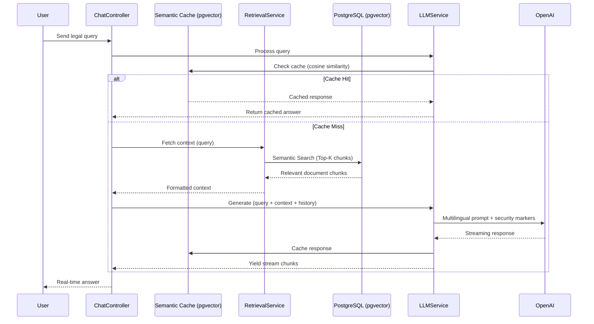

# OpenJustice Backend

An AI-powered legal assistance platform backend built with **FastAPI**, **PostgreSQL** (`pgvector`), and **Clean Architecture**. Provides multilingual legal Q&A, RAG-powered document retrieval, voice interface, and WhatsApp integration.

## 🚀 Overview

OpenJustice Backend is the core API server for an interactive legal assistant that helps users navigate Sri Lankan law. It leverages **RAG (Retrieval-Augmented Generation)** to provide legally grounded answers across **English**, **Sinhala**, and **Tamil**, with advanced features including:

- **Conversational AI** — Multi-turn chat with GPT-4o, streaming responses via WebSocket, and conversation history management
- **RAG Pipeline** — Legal document ingestion, LangChain text splitting with legal-domain separators, OpenAI embeddings, and pgvector similarity search
- **Semantic Cache** — pgvector-based response caching to reduce LLM costs and latency
- **Voice Interface** — Speech-to-text (OpenAI Whisper) and text-to-speech (OpenAI TTS) for voice-based interaction
- **WhatsApp Integration** — Full conversational AI via Twilio WhatsApp API, including voice message support
- **Prompt Security** — Injection detection and sanitization, plus neutral language validation for AI responses
- **Admin Analytics** — Dashboard with usage, cost, platform, multilingual, retrieval, security, and AI evaluation metrics
- **Background Evaluation** — Automated AI response quality evaluation pipeline running on a configurable interval

## 🧰 Tech Stack

| Category | Technology |
|---|---|
| **Framework** | FastAPI (Python 3.10+) |
| **Package Manager** | [uv](https://github.com/astral-sh/uv) (Rust-based, 10-100x faster than pip) |
| **Database** | PostgreSQL 15+ with `pgvector` extension |
| **ORM** | SQLAlchemy 2+ (async via `asyncpg`) |
| **Migrations** | Alembic (async-aware) |
| **Validation** | Pydantic 2 + pydantic-settings |
| **Authentication** | JWT (`python-jose`) + bcrypt (`passlib`) |
| **AI / LLM** | OpenAI GPT-4o / GPT-4o-mini via `openai` SDK |
| **RAG** | LangChain + langchain-openai + langchain-community |
| **Embeddings** | OpenAI `text-embedding-3-large` |
| **Speech-to-Text** | OpenAI Whisper API (`gpt-4o-mini-transcribe`) |
| **Text-to-Speech** | OpenAI TTS API (`gpt-4o-mini-tts`) |
| **WhatsApp** | Twilio WhatsApp API |
| **WebSocket** | FastAPI WebSocket with connection manager |
| **Token Counting** | tiktoken |
| **Testing** | pytest, pytest-asyncio, pytest-cov |
| **Code Quality** | Black, Flake8, mypy, isort |

## 🏗️ Architecture

The codebase follows **Clean Architecture** with four layers and strict dependency direction (outer → inner):

1. **Domain** — Core entities, abstract interfaces (ports), and domain exceptions
2. **Application** — Services (29 modules), DTOs, versioned prompt templates, and application exceptions
3. **Infrastructure** — SQLAlchemy repositories (15), ORM models (20), security handlers, external API clients, WebSocket manager, and logging
4. **Presentation** — FastAPI controllers (6), Pydantic schemas, JWT middleware, error handlers, and route configuration

### High-Level System Flow



### Core RAG Pipeline



## 📁 Project Structure

```
openjustice-backend/
├── app/
│   ├── main.py                          # FastAPI app entry point
│   ├── config.py                        # Settings (pydantic-settings + .env)
│   ├── domain/                          # Business rules & interfaces
│   │   ├── entities/                    # Domain entities (User)
│   │   ├── interfaces/                  # 15 abstract ports (repositories, clients)
│   │   ├── value_objects/               # Immutable value objects
│   │   └── exceptions/                  # Domain exceptions (auth, base)
│   ├── application/                     # Use cases & orchestration
│   │   ├── services/                    # 29 service modules
│   │   ├── dtos/                        # Frozen dataclass DTOs
│   │   ├── prompts/                     # PromptRegistry + MultilingualPromptBuilder
│   │   ├── exceptions/                  # AppError with HTTP metadata
│   │   ├── commands/                    # (reserved for write commands)
│   │   └── queries/                     # (reserved for read queries)
│   ├── infrastructure/                  # Technical adapters
│   │   ├── db/                          # Engine, session factory, init_db
│   │   ├── models/                      # 20 SQLAlchemy ORM models
│   │   ├── repositories/               # 15 repository implementations
│   │   ├── security/                    # JWT, bcrypt, prompt security
│   │   ├── external/                    # OpenAI client, Twilio client
│   │   ├── storage/                     # Local file storage handler
│   │   ├── websocket/                   # Connection manager + rate limiter
│   │   ├── logging/                     # Logger configuration
│   │   └── exceptions/                  # Infrastructure exceptions
│   └── presentation/                    # API interface
│       ├── controllers/                 # 6 FastAPI routers
│       ├── routes/                      # Central API router
│       ├── schemas/                     # Pydantic request/response models
│       ├── middleware/                   # Auth middleware + error handlers
│       ├── mappers/                     # ORM-to-DTO mappers
│       └── lifespan.py                  # Background task management
├── tests/unit/                          # Unit tests (mirroring app/ structure)
├── alembic/                             # Database migrations
├── pyproject.toml                       # Dependencies & tool config
├── uv.lock                              # Locked dependencies
├── alembic.ini                          # Alembic configuration
└── .env.example                         # Environment variable template
```

## 📡 API Routes

All routes are mounted under the `/api` prefix:

| Module | Prefix | Description |
|---|---|---|
| **Auth** | `/api/auth` | Login, register, logout, profile, password change |
| **Chat** | `/api/chats` | Conversations CRUD, messages, AI responses |
| **Documents** | `/api/documents` | Upload, list, delete legal documents |
| **Admin** | `/api/admin` | Analytics, user management, logs, monitoring |
| **WhatsApp** | `/api/whatsapp` | Twilio webhook for incoming messages/voice |
| **WebSocket** | `/api/ws` | Real-time streaming AI responses |

**Additional endpoints:**
- `GET /docs` — Swagger UI (OpenAPI)
- `GET /redoc` — ReDoc documentation
- `/media/*` — Persisted audio files
- `/temp/*` — Temporary TTS audio files

## ⚙️ Local Development Setup

### 1. Prerequisites

- **Python 3.10+**
- **uv** installed ([installation guide](https://docs.astral.sh/uv/getting-started/installation/))
- **PostgreSQL 15+** with the **`pgvector`** extension

```bash
# Quick PostgreSQL with pgvector via Docker
docker run -d --name pgvector-db \
  -e POSTGRES_PASSWORD=postgres \
  -p 5432:5432 \
  pgvector/pgvector:16
```

### 2. Configure Environment

```bash
cp .env.example .env
# Edit .env with your OpenAI API key, database URL, and secret key
```

Key environment variables:

| Variable | Required | Description |
|---|---|---|
| `OPENAI_API_KEY` | ✅ | OpenAI API key for GPT, Whisper, TTS, and embeddings |
| `DATABASE_URL` | ✅ | PostgreSQL connection string (`postgresql+asyncpg://...`) |
| `SECRET_KEY` | ✅ | JWT signing key (min 32 characters) |
| `TWILIO_ACCOUNT_SID` | ❌ | Twilio account SID (for WhatsApp) |
| `TWILIO_AUTH_TOKEN` | ❌ | Twilio auth token (for WhatsApp) |
| `TWILIO_WHATSAPP_NUMBER` | ❌ | Twilio WhatsApp sender number |
| `DEBUG` | ❌ | Enable debug mode (default: `False`) |

See [`.env.example`](.env.example) for the full list of configurable settings.

### 3. Install Dependencies

```bash
uv sync
```

### 4. Set PYTHONPATH

The repository root must be on `PYTHONPATH` so `import app.*` works:

```bash
# Windows PowerShell
$env:PYTHONPATH = (Get-Location).Path

# macOS / Linux
export PYTHONPATH="$(pwd)"
```

### 5. Initialize Database

Create all tables and activate the `vector` extension:

```bash
uv run python -m app.infrastructure.db.init_db
```

### 6. Run Migrations (if Alembic versions exist)

```bash
uv run alembic upgrade head
```

### 7. Run the Server

```bash
uv run uvicorn app.main:app --reload --host 0.0.0.0 --port 8000
```

API documentation is available at:
- **Swagger UI**: [http://127.0.0.1:8000/docs](http://127.0.0.1:8000/docs)
- **ReDoc**: [http://127.0.0.1:8000/redoc](http://127.0.0.1:8000/redoc)

## 🧪 Testing

```bash
# Run all tests
uv run pytest tests/ -v

# Run with coverage report
uv run pytest tests/ --cov=app --cov-report=html

# Run specific test file
uv run pytest tests/unit/application/test_auth_service.py -v
```

## 🔧 Code Quality

```bash
# Format code
uv run black .

# Sort imports
uv run isort .

# Lint
uv run flake8 .

# Type check
uv run mypy .
```

## 📦 Adding Dependencies

```bash
# Add a production dependency
uv add package-name

# Add a dev dependency
uv add --dev package-name
```

## 📚 Documentation

- **Project Structure Guide**: [`docs/1. BACKEND_PROJECT_STRUCTURE.md`](docs/1.%20BACKEND_PROJECT_STRUCTURE.md)
- **FastAPI**: https://fastapi.tiangolo.com/
- **SQLAlchemy 2.0**: https://docs.sqlalchemy.org/
- **Pydantic v2**: https://docs.pydantic.dev/
- **LangChain**: https://python.langchain.com/
- **OpenAI API**: https://platform.openai.com/docs/
- **pgvector**: https://github.com/pgvector/pgvector
- **uv**: https://docs.astral.sh/uv/
