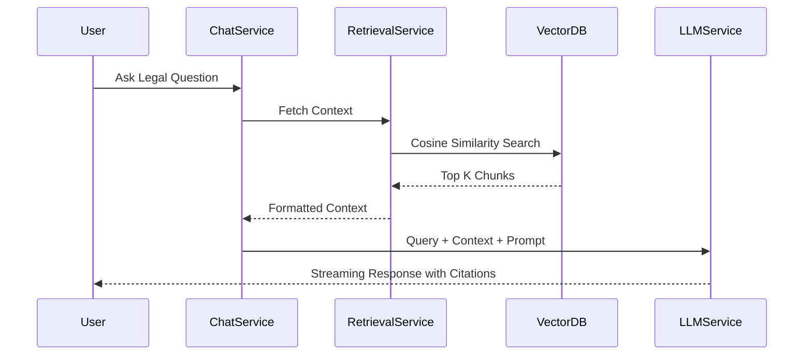

# 14️⃣ Documentation & Knowledge Transfer Guidelines

## 📋 Purpose

The OpenJustice platform is a complex intersection of software engineering, artificial intelligence, and legal data processing. The purpose of these guidelines is to make the project **highly understandable to academic examiners, external auditors, and future contributors**. Documentation must bridge the gap between technical implementation and research methodology.

---

## 🎯 Core Principles

1. **Self-Documenting Code First** - Rely on clean architecture and strict typing before writing comments.
2. **Explain the "Why"** - Code comments should explain *why* a decision was made, not *what* the code does.
3. **Traceability** - Every prompt, dataset, and architectural decision must be traceable back to its research methodology.
4. **Visual Understanding** - Complex pipelines must be accompanied by architecture diagrams.

---

## 📝 Code Documentation Standards

### Docstrings (Python)
We strictly adhere to the **Google Python Style Guide** for docstrings. Every class, module, and public function must have a docstring.

```python
# app/application/services/retrieval_service.py

class RetrievalService:
    """
    Orchestrates intelligent context retrieval from the Vector Database.
    
    This service is decoupled from the LLM Generation layer to ensure that
    retrieval metrics (latency, precision, recall) can be evaluated independently
    of the generation phase.
    """

    async def retrieve(self, query: str, top_k: int = 5) -> tuple[list, float]:
        """
        Executes a similarity search against the pgvector index.

        Args:
            query (str): The raw, un-normalized user query.
            top_k (int): The maximum number of document chunks to retrieve.

        Returns:
            tuple[list, float]: A tuple containing a list of DocumentChunk 
                                objects and the calculated confidence score.
                                
        Raises:
            VectorRetrievalError: If the pgvector connection times out.
        """
        pass
```

### Inline Comments
Avoid redundant inline comments. Reserve them for explaining complex algorithms, hacky workarounds (with `TODO` tags), or hardcoded limits dictated by third-party APIs.

```python
# BAD
x = x + 1 # Increment x

# GOOD
# We use chunk_size=1000 here because the OpenAI text-embedding-3-large model 
# exhibits degraded semantic density beyond this token limit in Indic languages.
chunk_size = 1000 
```

---

## 🗣️ Prompt Documentation

Prompts are the "source code" of an LLM system. They must be treated with the same documentation rigor as standard code.

### Prompt Registry
Prompts should not be scattered across the codebase. They must be centralized (e.g., in `MultilingualPromptBuilder`) and fully documented.

When documenting a prompt, you must include:
1. **Purpose**: What is the prompt supposed to achieve?
2. **Inputs**: What variables are injected into the prompt?
3. **Constraints**: What safety or formatting constraints are applied?

```python
# app/application/services/prompts.py

def build_citation_prompt(context: str) -> str:
    """
    PURPOSE: Forces the LLM to ground its answers strictly in the provided context
             and append formal citation markers.
    INPUTS: {context} -> The raw text chunks retrieved from the Vector DB.
    CONSTRAINTS: 
      - Prevents hallucination by enforcing a "say you don't know" rule.
      - Mandates [Source: Act Name, Section Y] formatting.
    """
    return f"""..."""
```

---

## 🏗️ Architecture Diagrams

Text descriptions are insufficient for explaining the RAG pipeline or async websocket flows to examiners. 

### Diagram Rules
1. **Tooling**: Use [Mermaid.js](https://mermaid.js.org/) for programmatic diagram generation. This allows diagrams to be version-controlled alongside the code.
2. **Location**: Diagrams must be embedded directly into the relevant feature's `README.md` or guideline document.

**Example RAG Flow Diagram:**


---

## 📐 Evaluation Methodology Docs

For academic defense, the methodology behind your evaluations must be explicitly documented. 

Create an `EVALUATION_METHODOLOGY.md` file in the `docs` folder detailing:
1. **Dataset Curation**: How were the 100+ legal questions generated? Were they verified by a legal professional?
2. **Metric Definitions**: A clear definition of RAGAS Faithfulness vs. Context Precision in the context of Sri Lankan law.
3. **Baseline Comparisons**: What was the baseline system performance (e.g., `gpt-3.5-turbo` with no RAG) compared to the final architecture?

---

## 📜 Change Logs

To demonstrate iterative improvement and active development, maintain a `CHANGELOG.md` at the root of the repository.

* Use the format defined by [Keep a Changelog](https://keepachangelog.com/en/1.0.0/).
* Categorize changes under `[Added]`, `[Changed]`, `[Deprecated]`, `[Removed]`, `[Fixed]`, or `[Security]`.

**Example:**
```markdown
## [1.1.0] - 2025-10-15
### Added
- Redis Semantic Caching to intercept redundant queries before hitting OpenAI.
### Changed
- Downgraded `OPENAI_MODEL` from `gpt-4o` to `gpt-4o-mini` to drastically reduce system operating costs without sacrificing evaluation metrics.
```

---

## 🚀 Future Work Documentation

No project is ever truly "finished," especially in academia. It is critical to document the boundaries of your current implementation and outline a roadmap for future researchers.

Maintain a `FUTURE_WORK.md` document outlining:
1. **Known Limitations**: Be honest. (e.g., "The current Sinhala tokenizer struggles with highly archaic legal terminology from the 19th-century penal code.")
2. **Scalability Bottlenecks**: (e.g., "The synchronous PostgreSQL connection limits concurrent WebSocket users to 500.")
3. **Next Steps**: (e.g., "Implement GraphRAG to map relationships between complex overlapping property acts.")
