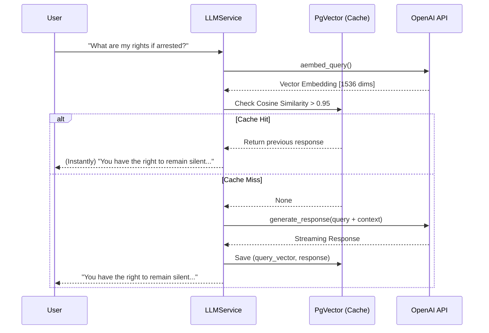

# 15️⃣ Semantic Caching Guidelines

## 📋 Purpose

To reduce API costs, improve response latency, and limit redundant generation, the OpenJustice platform uses **Semantic Caching**. When a user asks a question that is mathematically similar to a question asked previously (e.g., "What are my rights if I am arrested?" vs. "If I get arrested, what rights do I have?"), the system will return the previously generated answer instead of hitting the OpenAI API.

---

## 🎯 Core Principles

1. **Similarity Threshold**: We use a `CACHE_SIMILARITY_THRESHOLD` (default: 0.95) to determine if a query matches. This equates to a cosine distance of < 0.05.
2. **Transparent Interception**: The cache operates invisibly inside the `LLMService`. It intercepts requests before they hit the external AI models.
3. **Infrastructure Re-use**: To avoid adding Redis Stack to the project dependencies, we use the existing PostgreSQL `pgvector` extension.
4. **Vector Embeddings**: Both the document retrieval engine and the semantic cache use `text-embedding-3-large` via the OpenAI embeddings API.

---

## 🏗️ Architecture

The Semantic Cache is implemented via the Clean Architecture pattern:

1. **Domain**: `ISemanticCacheRepository` abstract interface.
2. **Infrastructure**: `PgVectorSemanticCacheRepository` implementation using SQLAlchemy and pgvector `cosine_distance` operations.
3. **Application**: `LLMService` which checks the cache first, and writes to the cache if a new answer is generated.

### Execution Flow



---

## ⚙️ Configuration

The caching mechanism is controlled via `app/config.py`.

```python
class Settings(BaseSettings):
    # Semantic Cache Settings
    CACHE_SIMILARITY_THRESHOLD: float = 0.95
```

### Adjusting the Threshold
* **Too High (e.g., 0.99)**: The cache will act like an exact-string match. Very few queries will hit the cache.
* **Too Low (e.g., 0.80)**: The cache will return false positives. Completely different legal questions might return the same answer.
* **Optimal Range**: **0.93 - 0.96** is generally considered safe for English, Sinhala, and Tamil semantic clustering.

---

## 🧹 Cache Invalidation & Maintenance

Because laws change over time, the semantic cache cannot live forever. Stale legal answers could be served if legislation is updated.

### Clearing the Cache
If you update your Vector Database with a new penal code or act, **you must flush the semantic cache table** to force the LLM to generate new answers based on the updated documents.

```sql
-- Flush the entire semantic cache
TRUNCATE TABLE semantic_caches;
```

### Future Implementations (TTL)
Future iterations of this cache will implement a Time-To-Live (TTL) mechanic (e.g., automatically deleting rows where `created_at < 30_days_ago`).
