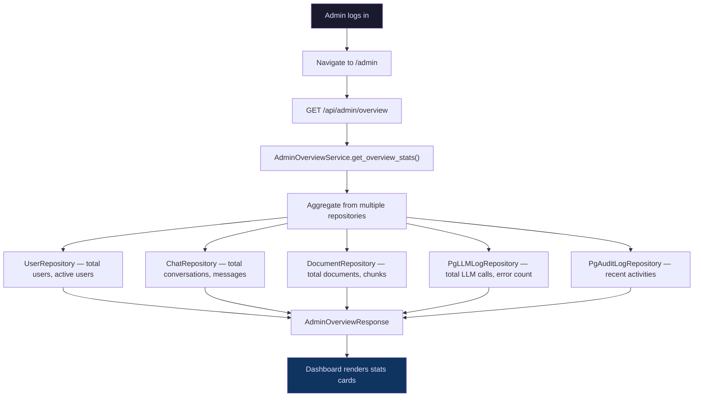
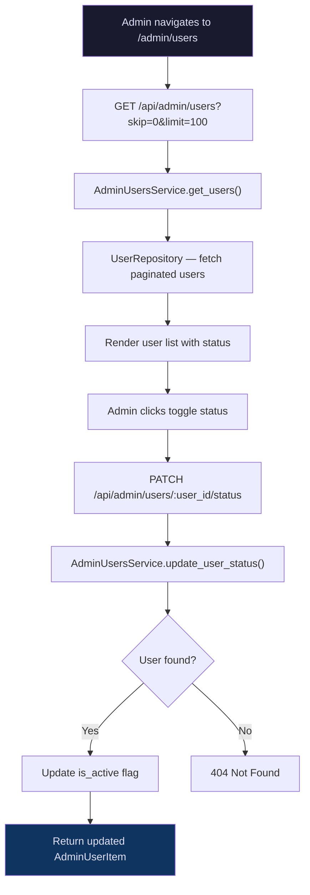
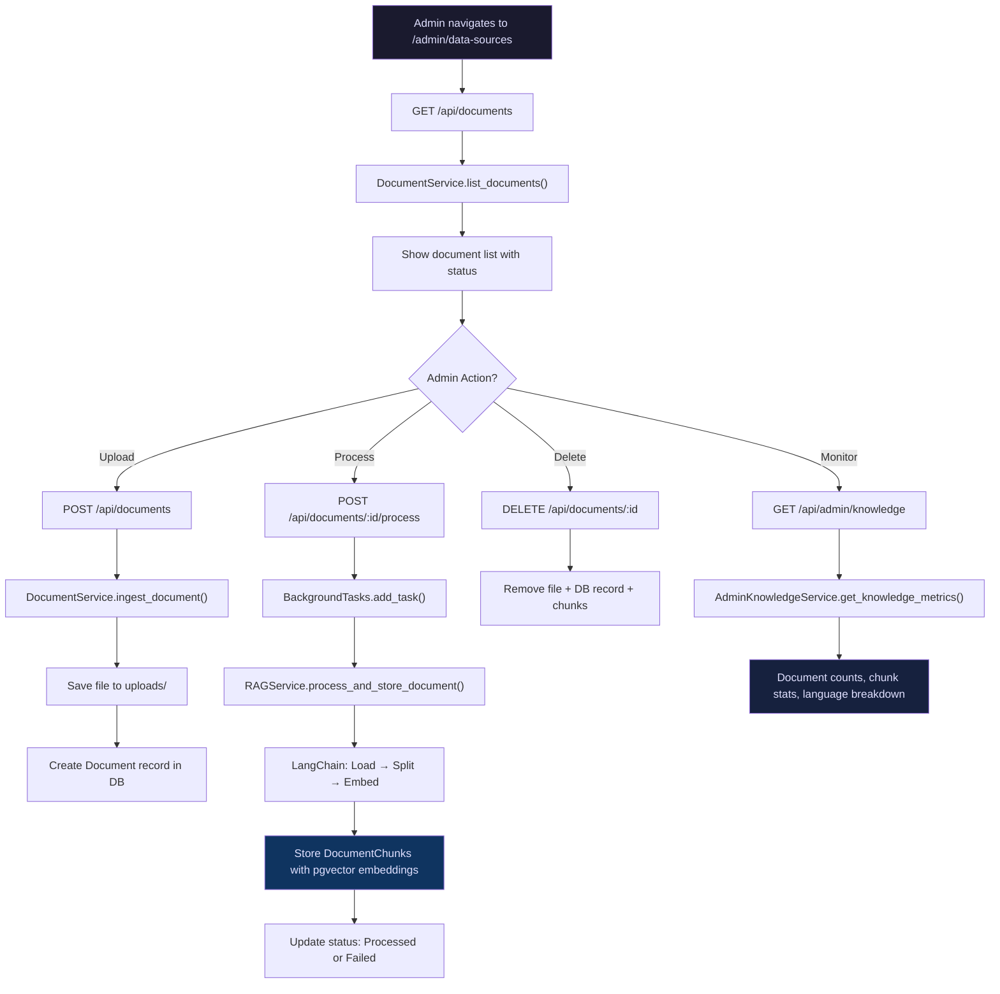
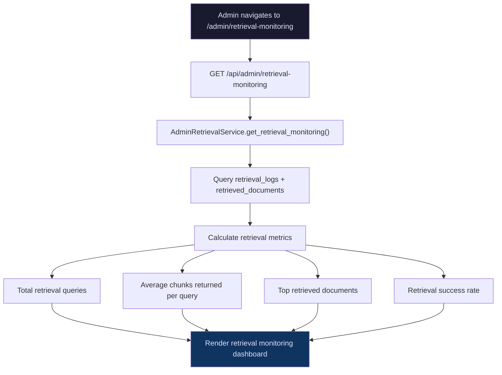
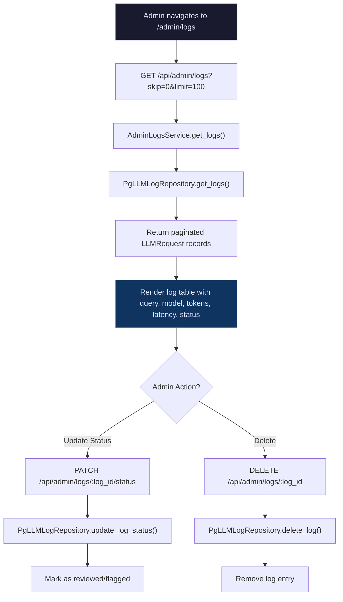
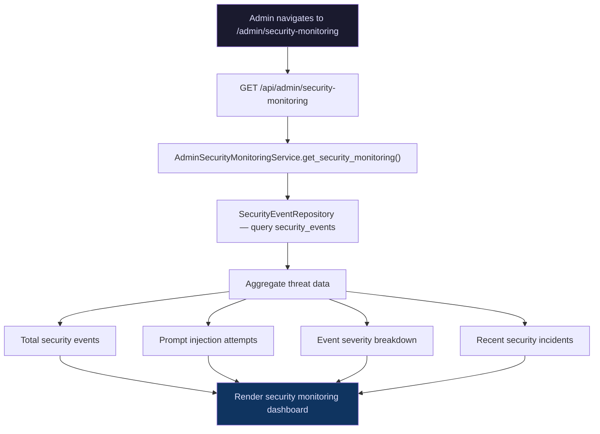
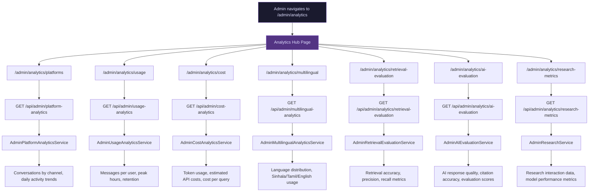
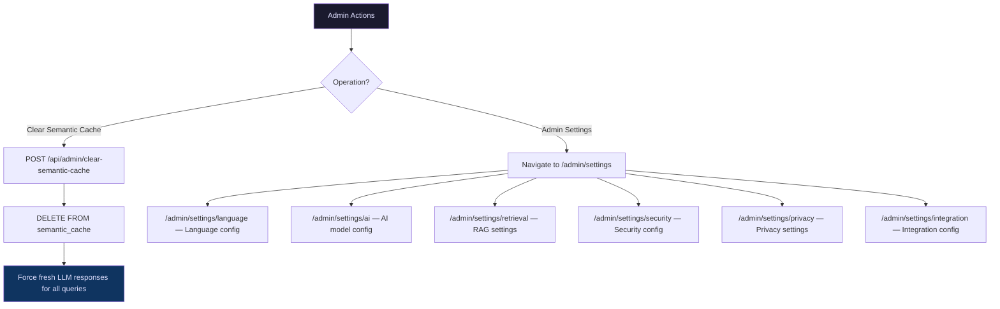
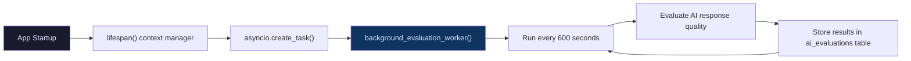

# Admin Flow Diagram

## Overview

This document maps the complete admin journey through the OpenJustice admin panel — from the dashboard overview to analytics, user management, knowledge base monitoring, and system configuration.

---

## 🏠 Admin Dashboard Overview

The admin dashboard (`/admin`) is the central hub that aggregates system-wide statistics.



---

## 👥 User Management Flow

Admins can view all registered users and toggle their active status.



---

## 📚 Knowledge Base & Document Management Flow

Admins manage the legal document knowledge base — upload, process, and monitor documents.



---

## 🔍 Retrieval Monitoring Flow

Monitor RAG pipeline performance — how documents are being retrieved and used.



---

## 📋 LLM Logs Management Flow

View, filter, and manage LLM request/response logs for debugging and research.



---

## 🛡️ Security Monitoring Flow

Monitor security events and prompt injection attempts.



---

## 📊 Analytics Flow

The analytics section provides multiple views into platform performance, usage, costs, and research metrics.



---

## ⚙️ System Operations Flow



---

## 🗺️ Complete Admin Navigation Map

```mermaid
flowchart TD
    ADMIN["/admin — Dashboard Overview"] --> USERS["/admin/users — User Management"]
    ADMIN --> DATA["/admin/data-sources — Document Upload"]
    ADMIN --> KNOWLEDGE["/admin/knowledge-monitoring — Knowledge Base"]
    ADMIN --> RETRIEVAL["/admin/retrieval-monitoring — Retrieval Monitoring"]
    ADMIN --> SECURITY["/admin/security-monitoring — Security Monitoring"]
    ADMIN --> LOGS["/admin/logs — LLM Logs"]
    ADMIN --> ERRORS["/admin/error-monitoring — Error Monitoring"]
    ADMIN --> ANALYTICS["/admin/analytics — Analytics Hub"]
    ADMIN --> SETTINGS["/admin/settings — Settings"]

    ANALYTICS --> A1["/admin/analytics/platforms"]
    ANALYTICS --> A2["/admin/analytics/usage"]
    ANALYTICS --> A3["/admin/analytics/cost"]
    ANALYTICS --> A4["/admin/analytics/multilingual"]
    ANALYTICS --> A5["/admin/analytics/retrieval-evaluation"]
    ANALYTICS --> A6["/admin/analytics/ai-evaluation"]
    ANALYTICS --> A7["/admin/analytics/research-metrics"]

    SETTINGS --> S1["/admin/settings/language"]
    SETTINGS --> S2["/admin/settings/ai"]
    SETTINGS --> S3["/admin/settings/retrieval"]
    SETTINGS --> S4["/admin/settings/security"]
    SETTINGS --> S5["/admin/settings/privacy"]
    SETTINGS --> S6["/admin/settings/integration"]

    style ADMIN fill:#1a1a2e,color:#e0e0ff
    style ANALYTICS fill:#533483,color:#e0e0ff
    style SETTINGS fill:#0f3460,color:#e0e0ff
```



---

## 📡 Admin API Endpoints Summary

| Endpoint | Method | Service | Purpose |
|---|---|---|---|
| `/api/admin/overview` | GET | `AdminOverviewService` | Dashboard statistics |
| `/api/admin/users` | GET | `AdminUsersService` | List all users |
| `/api/admin/users/:id/status` | PATCH | `AdminUsersService` | Toggle user active status |
| `/api/admin/knowledge` | GET | `AdminKnowledgeService` | Knowledge base metrics |
| `/api/admin/retrieval-monitoring` | GET | `AdminRetrievalService` | RAG retrieval stats |
| `/api/admin/security-monitoring` | GET | `AdminSecurityMonitoringService` | Security events |
| `/api/admin/logs` | GET | `AdminLogsService` | Paginated LLM logs |
| `/api/admin/logs/:id/status` | PATCH | `AdminLogsService` | Update log status |
| `/api/admin/logs/:id` | DELETE | `AdminLogsService` | Delete log entry |
| `/api/admin/clear-semantic-cache` | POST | Direct DB delete | Clear semantic cache |
| `/api/admin/platform-analytics` | GET | `AdminPlatformAnalyticsService` | Platform usage |
| `/api/admin/usage-analytics` | GET | `AdminUsageAnalyticsService` | User engagement |
| `/api/admin/cost-analytics` | GET | `AdminCostAnalyticsService` | API cost tracking |
| `/api/admin/multilingual-analytics` | GET | `AdminMultilingualAnalyticsService` | Language stats |
| `/api/admin/analytics/retrieval-evaluation` | GET | `AdminRetrievalEvaluationService` | RAG evaluation |
| `/api/admin/analytics/ai-evaluation` | GET | `AdminAIEvaluationService` | AI quality metrics |
| `/api/admin/analytics/research-metrics` | GET | `AdminResearchService` | Research metrics |

---

## 🔄 Background Evaluation Pipeline

An automated evaluation pipeline runs continuously in the background via the application lifespan:



```python
# app/presentation/lifespan.py
@asynccontextmanager
async def lifespan(app: FastAPI):
    task = asyncio.create_task(background_evaluation_worker(interval_seconds=600))
    yield
    task.cancel()
```

---

_Last updated: June 2026_
