# Database Architecture

## 📋 Overview

The OpenJustice platform uses **PostgreSQL 15+** with the **pgvector** extension as its primary relational database and vector store. 
All ORM mappings are handled via **SQLAlchemy 2.0+** using asyncpg, and migrations are managed via **Alembic**.

The database architecture is designed to support:
- **Core Application Data**: Users, Sessions, Conversations, and Messages.
- **Retrieval-Augmented Generation (RAG)**: Document metadata, chunking, and vector embeddings (pgvector).
- **Comprehensive Telemetry**: Granular logging of LLM requests, retrieval logs, and system errors for debugging and analytics.
- **Evaluation & Research**: Storing metrics for AI performance, hallucination rates, and dataset generation.

---

## 🗺️ Entity-Relationship Diagram (ERD)

```mermaid
erDiagram
    %% Authentication & Users
    users ||--o{ user_sessions : "has"
    users ||--o{ conversations : "owns"
    users ||--o{ audit_logs : "generates"
    users ||--o{ llm_requests : "makes"
    users ||--o{ audio_requests : "initiates"

    users {
        UUID id PK
        varchar first_name
        varchar last_name
        varchar email
        varchar phone_number
        varchar role
        varchar preferred_language
        boolean is_active
        boolean is_email_verified
        varchar email_verification_token
        timestamp email_verification_expires_at
        integer failed_login_attempts
        timestamp locked_until
        varchar avatar_url
        varchar hashed_password
        timestamp created_at
        timestamp updated_at
    }

    user_sessions {
        UUID id PK
        UUID user_id FK
        UUID session_token
        varchar channel
        varchar ip_address
        varchar user_agent
        timestamp created_at
        timestamp expires_at
    }

    audit_logs {
        UUID id PK
        UUID user_id FK
        varchar action
        varchar entity
        UUID entity_id
        jsonb metadata_
        timestamp created_at
    }

    %% Chat & Messages
    conversations ||--o{ messages : "contains"
    conversations {
        UUID id PK
        UUID user_id FK
        varchar title
        varchar channel
        boolean is_archived
        boolean is_pinned
        timestamp created_at
    }

    messages {
        UUID id PK
        UUID conversation_id FK
        varchar sender
        varchar content
        varchar language
        varchar message_type
        varchar audio_path
        timestamp created_at
    }

    %% Knowledge Base & RAG
    documents ||--o{ document_chunks : "split into"
    documents {
        UUID id PK
        varchar title
        varchar document_type
        varchar language
        varchar source_url
        varchar storage_path
        varchar status
        integer published_year
        varchar collection_id
        timestamp created_at
    }

    document_chunks {
        UUID id PK
        UUID document_id FK
        text content
        varchar language
        vector embedding
        jsonb metadata_
        integer chunk_index
        integer chunk_total
        integer chunk_size
        varchar embedding_model
        varchar embedding_version
        varchar chunking_version
        timestamp created_at
        timestamp updated_at
    }

    semantic_caches {
        UUID id PK
        varchar query_text
        vector query_embedding
        text response_text
        timestamp created_at
    }

    %% Telemetry & Logging
    llm_requests ||--o{ llm_responses : "receives"
    llm_requests {
        UUID id PK
        UUID correlation_id
        UUID user_id FK
        text query
        text context
        varchar model_name
        varchar prompt_version
        float temperature
        integer max_tokens
        integer prompt_tokens
        integer completion_tokens
        integer total_tokens
        integer latency_ms
        timestamp created_at
        varchar status
        text error_message
    }

    llm_responses {
        UUID id PK
        UUID llm_request_id FK
        text response_text
        varchar confidence_level
    }

    retrieval_logs ||--o{ retrieved_documents : "yields"
    retrieval_logs {
        UUID id PK
        UUID correlation_id
        UUID conversation_id
        varchar query
        varchar language
        integer top_k
        integer retrieval_latency_ms
        timestamp created_at
    }

    document_chunks ||--o{ retrieved_documents : "is retrieved as"
    retrieved_documents {
        UUID id PK
        UUID retrieval_log_id FK
        UUID document_chunk_id FK
        float similarity_score
    }

    audio_requests {
        UUID id PK
        UUID user_id FK
        varchar audio_type
        varchar language
        float duration_seconds
        integer characters_generated
        varchar provider
        timestamp created_at
    }

    system_errors {
        UUID id PK
        varchar error_type
        text message
        text details
        timestamp created_at
    }

    security_events {
        UUID id PK
        varchar area
        varchar source
        text detail
        varchar severity
        boolean is_priority
        jsonb metadata_
        timestamp created_at
    }

    %% Analytics & Evaluation
    ai_evaluations {
        UUID id PK
        timestamp evaluation_date
        varchar model_name
        float accuracy
        float hallucination_rate
        integer avg_tokens
    }

    retrieval_evaluations {
        UUID id PK
        timestamp evaluation_date
        float recall_at_5
        float precision_at_5
    }

    research_metrics {
        varchar id PK
        varchar label
        varchar value
        varchar note
        varchar trend
        timestamp created_at
    }

    evaluation_datasets ||--o{ evaluation_dataset_items : "contains"
    
    evaluation_datasets {
        varchar id PK
        varchar name
        varchar version
        integer samples
        varchar split
        varchar last_run
        varchar status
        timestamp created_at
    }

    evaluation_dataset_items {
        varchar id PK
        varchar dataset_id FK
        varchar query
        varchar ground_truth_answer
        varchar golden_context
        varchar metadata_json
        timestamp created_at
    }

    experiment_notes {
        varchar id PK
        varchar title
        varchar description
        timestamp created_at
    }

    %% System Configuration
    system_settings {
        varchar id PK
        jsonb enabled_languages
        varchar default_language
        boolean translation_pipeline_enabled
        varchar ai_model_name
        float ai_temperature
        integer ai_max_tokens
        float ai_top_p
        float ai_frequency_penalty
        integer retrieval_top_k
        float retrieval_similarity_threshold
        varchar retrieval_embedding_model
        integer retrieval_chunk_size
        integer retrieval_chunk_overlap
        integer jwt_expiry_minutes
        integer rate_limit_per_minute
        boolean prompt_validation_enabled
        integer account_lockout_threshold
        varchar openai_api_key
        varchar twilio_account_sid
        varchar twilio_auth_token
        varchar whatsapp_phone_number
        varchar web_socket_url
    }
```

---

## 📊 Data Dictionary

### 1. Authentication & Users

#### `users`
Core entity for authentication, authorization, and preferences.
- **id** (`UUID`, PK): Unique identifier.
- **email** / **phone_number**: Unique identifiers for authentication.
- **role**: Authorization level (e.g., `user`, `admin`).
- **preferred_language**: Used by the Multilingual Prompt Builder to reply in the user's preferred language.
- **is_email_verified**: Indicates if the user has validated their email address.
- **locked_until**, **failed_login_attempts**: Rate-limiting and security protection against brute force.

#### `user_sessions`
Tracks active JWT sessions across devices and platforms.
- **id** (`UUID`, PK): Unique identifier.
- **user_id** (`UUID`, FK): Reference to the `users` table.
- **session_token** (`UUID`): Used to match with the JWT payload.
- **channel**, **ip_address**, **user_agent**: Device details for audit.

#### `audit_logs`
Logs critical system activities executed by users (e.g., login, password reset, settings change).
- **action**, **entity**, **entity_id**: Tracks exactly what was done to which entity.

---

### 2. Chat System

#### `conversations`
Represents a threaded chat with the LLM or an agent.
- **id** (`UUID`, PK): Unique identifier.
- **user_id** (`UUID`, FK): Reference to `users`.
- **channel**: Source of the conversation (e.g., `web`, `whatsapp`).
- **is_pinned**, **is_archived**: UI status flags.

#### `messages`
Individual messages within a conversation.
- **id** (`UUID`, PK): Unique identifier.
- **conversation_id** (`UUID`, FK): Reference to `conversations`.
- **sender**: Identifies if the sender is `user` or `assistant`.
- **message_type**: Identifies if the message is `text` or `voice`.
- **audio_path**: Path to the generated or user-uploaded audio file (if applicable).

---

### 3. Knowledge Base & Vector Search (RAG)

#### `documents`
Metadata for ingested legal files and cases.
- **id** (`UUID`, PK): Unique identifier.
- **document_type**, **status**: Document state in the ingestion pipeline (e.g., `Processed`, `Failed`).

#### `document_chunks`
Segmented document text enriched with vector embeddings.
- **id** (`UUID`, PK): Unique identifier.
- **document_id** (`UUID`, FK): Reference to `documents`.
- **embedding** (`Vector`): `pgvector` column storing semantic vectors (e.g., 3072 dimensions for OpenAI models).
- **chunk_index**, **chunk_size**: Chunk positional metadata.

#### `semantic_caches`
Vector-based semantic caching layer to instantly respond to previously seen user queries without hitting the LLM.
- **query_embedding** (`Vector`): Stored embedding of the query for >95% similarity lookups.
- **response_text**: The cached response.

---

### 4. Telemetry & Monitoring

#### `llm_requests` & `llm_responses`
Comprehensive telemetry logging of every outgoing request to OpenAI or other LLM providers.
- **prompt_tokens**, **completion_tokens**, **latency_ms**: For cost and performance tracking.
- **prompt_version**: Links the request to the specific Langchain prompt template used.

#### `retrieval_logs` & `retrieved_documents`
Tracks vector similarity searches for RAG performance evaluation.
- Logs how long semantic searches take, which `document_chunks` were retrieved, and their `similarity_score`.

#### `audio_requests`
Tracks STT (Whisper) and TTS requests for cost and performance analytics.

#### `system_errors`
Centralized error repository.
- **error_type**, **message**, **details**: Full stack trace and context for unhandled exceptions.

#### `security_events`
Monitors for prompt injections and unauthorized access attempts.
- **severity**, **is_priority**: Priority flagging for dashboard alerts.

---

### 5. Evaluation & Research
Tables used for background evaluation of AI responses and research features.
- **ai_evaluations**: Tracks hallucination rates and accuracy over time via LLM-as-a-judge pipelines.
- **retrieval_evaluations**: RAG pipeline metrics (Recall@5, Precision@5).

#### `research_metrics`
General metrics tracking for the Research hub dashboard (e.g. tracking aggregate scores over time).
- **label**, **value**, **trend**: For rendering trend line UI components.

#### `evaluation_datasets` & `evaluation_dataset_items`
Manages synthetic and real datasets used for testing the system.
- **evaluation_datasets**: Master record for a specific dataset split (e.g. validation, test) and its processing status.
- **evaluation_dataset_items**: Individual Q&A pairs (query + ground_truth_answer) for batch evaluation against the model.

#### `experiment_notes`
Stores qualitative observations and notes made by admins during evaluation runs.

---

### 6. System Configuration

#### `system_settings`
Global, dynamically updateable application config.
- Single-row table or key-based table used to define platform behaviors, limits, prompt validation toggles, and LLM thresholds dynamically without deploying environment variable changes.
