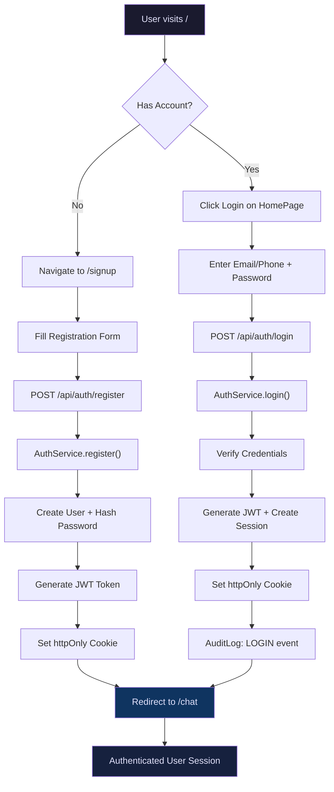
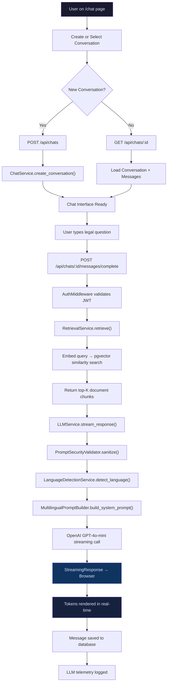
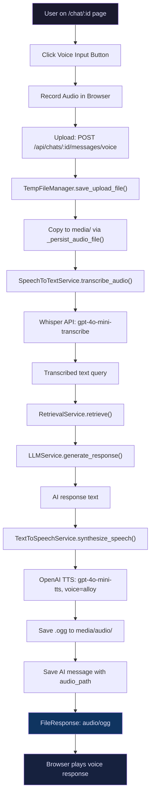
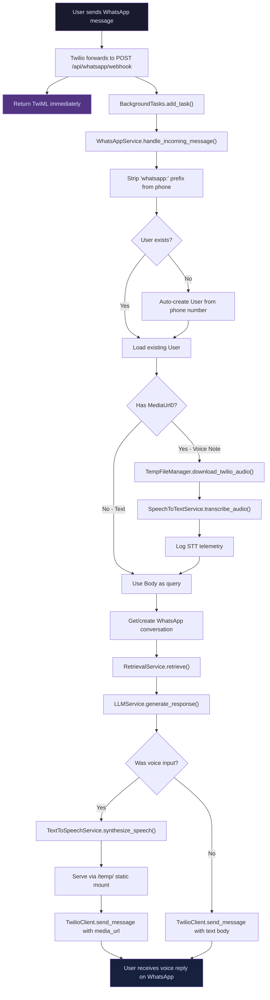
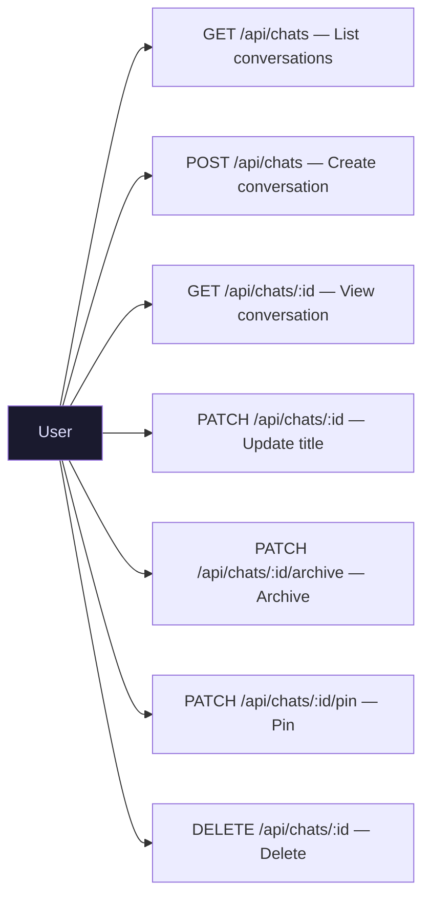
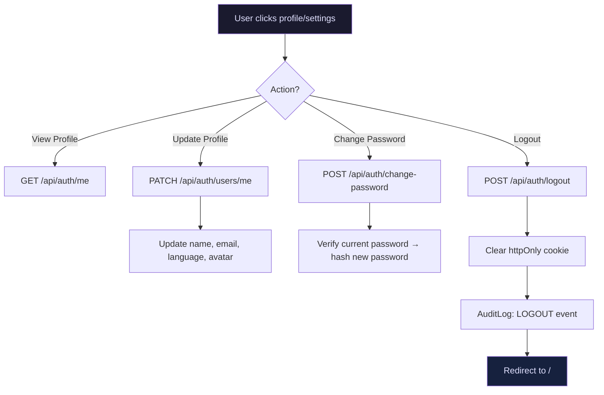
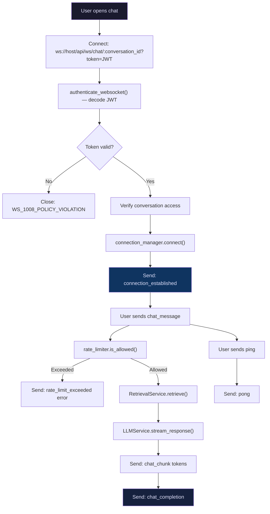
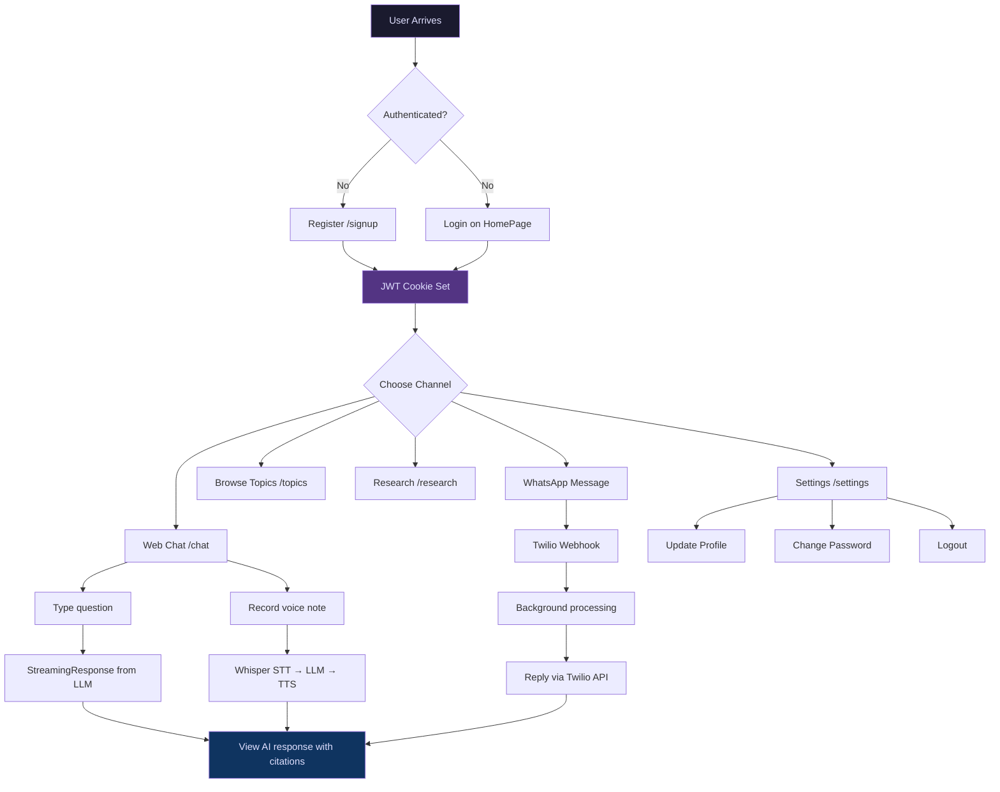

# User Flow Diagram

## Overview

This document maps the complete user journey through the OpenJustice platform — from registration to legal assistance via web chat, voice, and WhatsApp channels.

---

## 🔐 Authentication Flow

---

## 💬 Web Chat Flow (Text)

The primary user interaction — ask a legal question and receive an AI-generated response with citations.

---

## 🎤 Voice Chat Flow (Web)

Users can send voice notes through the web interface, receiving AI-generated audio responses.

---

## 📱 WhatsApp Flow (Twilio)

Users interact via WhatsApp — the system auto-provisions users and handles both text and voice notes.

---

## 🔄 Conversation Management Flow

---

## ⚙️ User Settings & Profile Flow

---

## 🔍 WebSocket Real-Time Chat Flow

An alternative real-time channel using WebSocket for live token streaming.

---

## 📊 Complete User Journey Map

---

_Last updated: June 2026_
